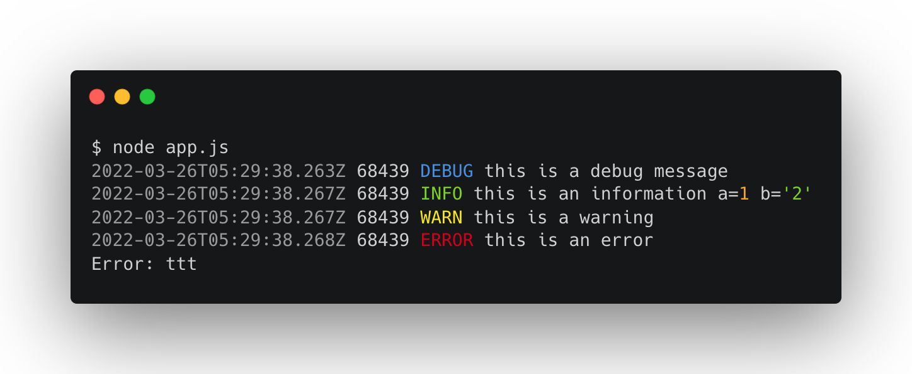
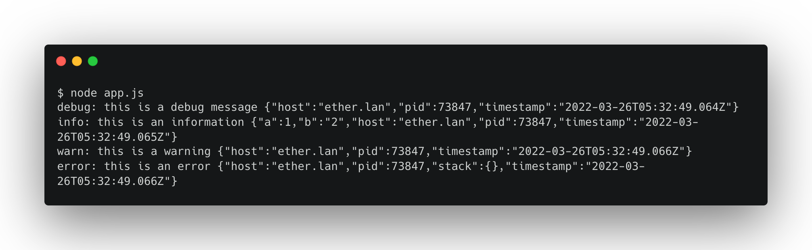

# winston-humanize-console-transport

Print logs to the console in a human-readable format.

### Installation

```sh
yarn add winston-humanize-console-transport
```

or

```sh
npm i -S winston-humanize-console-transport
```

### Usage

```ts
import { createLogger, format } from 'winston'
import os from 'os'
import ConsoleTransport from 'winston-humanize-console-transport'

const { combine, timestamp } = format

const logger = createLogger({
  level: 'debug',
  defaultMeta: { pid: process.pid, host: os.hostname() },
  format: combine(timestamp()),
  transports: [new ConsoleTransport()],
})
```

### Example

```ts
logger.debug('this is a debug message')
logger.info('this is an information', { a: 1, b: '2' })
logger.warn('this is a warning')
logger.error('this is an error', { stack: new Error('ttt') })
```



<center>with humanize</center>



<center>without humanize</center>

### Feature

- Highlight log level with color.
- Inspect metadata with type highlight.
- Extract key information.
- Hide non-essential metadata.
- Print error stack independently.

### Detail

We use following keys in metadata to highlight:

- timestamp (you can combine `timestamp` on format)
- module (to highlight module name)
- traceId (to highlight trace id)
- stack (to print error stack independently)
- pid (to highlight process id)

### License

MIT Licensed
